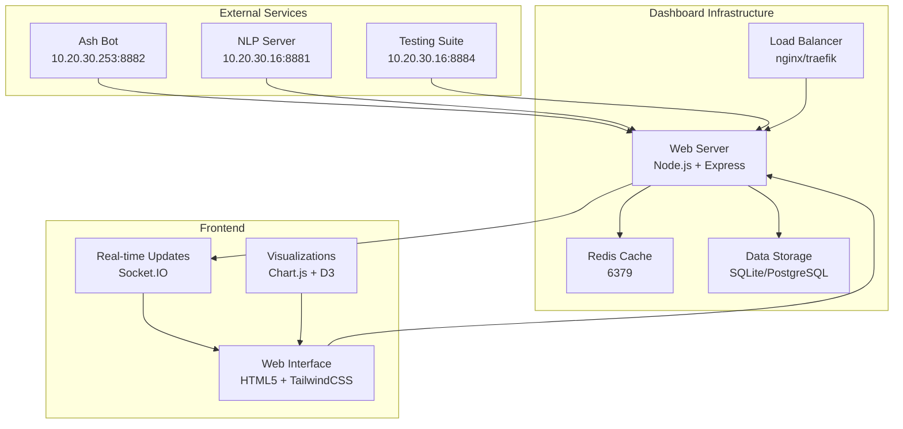

# 🔧 Ash Analytics Dashboard Implementation Guide

Technical implementation and development guide for ash-dash v2.1

---

## 🎯 Overview

This guide provides comprehensive technical implementation details for developers, system administrators, and technical team members working with the Ash Analytics Dashboard. It covers architecture, development workflows, advanced configuration, and integration patterns.

### **Target Audience**
- Software developers contributing to the project
- System administrators managing deployments
- DevOps engineers setting up CI/CD
- Technical leads planning integrations

---

## 🏗️ Architecture Deep Dive

### **System Architecture**



### **Component Breakdown**

#### **Backend Services**
- **Express.js Server**: REST API, WebSocket handling, middleware stack
- **Redis Cache**: Multi-layer caching, session management, pub/sub
- **Database Layer**: Data persistence, query optimization, migrations
- **Service Integration**: External API clients, failover handling, rate limiting

#### **Frontend Components**  
- **Dashboard UI**: Responsive interface, real-time updates, accessibility
- **Chart Engine**: Interactive visualizations, real-time data binding
- **WebSocket Client**: Live updates, connection management, reconnection logic
- **Export Engine**: Data formatting, file generation, download management

#### **Integration Layer**
- **API Gateway**: Request routing, authentication, rate limiting
- **Health Monitoring**: Service discovery, health checks, alerting
- **Event System**: Real-time notifications, pub/sub messaging
- **Data Pipeline**: ETL processes, data transformation, aggregation

---

## 🛠️ Development Environment Setup

### **Prerequisites for Development**

**System Requirements:**
- Node.js 18.x or 20.x LTS
- Docker Desktop 4.0+ (for your Windows environment)
- Git 2.30+
- Visual Studio Code or Atom (your preference)

**Recommended Extensions/Tools:**
- ESLint and Prettier for code formatting
- Docker extension for VS Code
- REST Client for API testing
- GitLens for Git integration

### **Local Development Setup**

#### **1. Repository Setup**
```powershell
# Clone the repository
git clone https://github.com/The-Alphabet-Cartel/ash-dash.git
cd ash-dash

# Set up development branch
git checkout -b feature/your-feature-name

# Install dependencies
cd dashboard
npm install

# Install development dependencies
npm install --save-dev
```

#### **2. Environment Configuration**
```powershell
# Copy development environment template
Copy-Item .env.template .env.development

# Edit development configuration
# Use your preferred editor (Atom in your case)
atom .env.development
```

**Development Environment Variables:**
```bash
# Development Configuration
NODE_ENV=development
PORT=8883
ENABLE_SSL=false  # Disable SSL for local development

# Service Endpoints (use staging/dev if available)
ASH_BOT_API=http://10.20.30.253:8882
ASH_NLP_API=http://10.20.30.16:8881
ASH_TESTING_API=http://10.20.30.16:8884

# Development-specific settings
LOG_LEVEL=debug
ENABLE_DEBUG_ROUTES=true
ENABLE_MOCK_DATA=true  # Use mock data when services unavailable
CACHE_TTL=10  # Short cache for development

# Development tools
ENABLE_HOT_RELOAD=true
ENABLE_SOURCE_MAPS=true
WEBPACK_DEV_SERVER=true
```

#### **3. Database Setup**
```powershell
# Initialize development database
npm run db:setup

# Run migrations
npm run db:migrate

# Seed development data
npm run db:seed
```

#### **4. Redis Setup**
```powershell
# Option 1: Use Docker for Redis
docker run -d --name dev-redis -p 6379:6379 redis:7-alpine

# Option 2: Use existing Redis instance
# Update REDIS_URL in .env.development
```

### **Development Workflow**

#### **Starting Development Server**
```powershell
# Start with hot reload
npm run dev

# Start with debugging
npm run dev:debug

# Start with profiling
npm run dev:profile
```

#### **Available Development Scripts**
```bash
npm run dev              # Start development server with hot reload
npm run dev:debug        # Start with Node.js debugger
npm run dev:inspect      # Start with Chrome DevTools integration
npm run build            # Build production assets
npm run build:dev        # Build development assets with source maps
npm run test             # Run all tests
npm run test:unit        # Run unit tests only
npm run test:integration # Run integration tests
npm run test:e2e         # Run end-to-end tests
npm run lint             # Run ESLint
npm run lint:fix         # Fix ESLint issues automatically
npm run format           # Format code with Prettier
npm run type-check       # TypeScript type checking (if applicable)
```

#### **Development vs Production Differences**
```javascript
// Development features
if (process.env.NODE_ENV === 'development') {
  // Enable debug routes
  app.use('/debug', debugRoutes);
  
  // Enable mock data
  app.use('/api/mock', mockDataRoutes);
  
  // Detailed error responses
  app.use(detailedErrorHandler);
  
  // Hot reload support
  if (module.hot) {
    module.hot.accept();
  }
}

// Production optimizations
if (process.env.NODE_ENV === 'production') {
  // Enable compression
  app.use(compression());
  
  // Security headers
  app.use(helmet());
  
  // Rate limiting
  app.use(rateLimiter);
}
```

---

## 📦 Project Structure and Architecture

### **Directory Structure**
```
ash-dash/
├── .github/                    # GitHub workflows and templates
│   ├── workflows/             # CI/CD workflows
│   └── ISSUE_TEMPLATE.md      # Issue templates
├── dashboard/                  # Backend application
│   ├── src/                   # Source code
│   │   ├── controllers/       # Route controllers
│   │   ├── middleware/        # Express middleware
│   │   ├── services/          # Business logic services
│   │   ├── models/            # Data models
│   │   ├── utils/             # Utility functions
│   │   └── config/            # Configuration management
│   ├── tests/                 # Backend tests
│   │   ├── unit/             # Unit tests
│   │   ├── integration/      # Integration tests
│   │   └── fixtures/         # Test data
│   ├── migrations/            # Database migrations
│   ├── seeds/                 # Database seed data
│   └── package.json          # Backend dependencies
├── public/                     # Frontend static files
│   ├── src/                   # Frontend source
│   │   ├── js/               # JavaScript modules
│   │   ├── css/              # Stylesheets
│   │   ├── components/       # Reusable components
│   │   └── utils/            # Frontend utilities
│   ├── assets/               # Static assets
│   │   ├── images/           # Images and icons
│   │   ├── fonts/            # Custom fonts
│   │   └── data/             # Static data files
│   ├── dist/                 # Built/compiled assets
│   └── index.html            # Main HTML template
├── docs/                       # Documentation
│   ├── api/                  # API documentation
│   ├── deployment/           # Deployment guides
│   ├── development/          # Development guides
│   └── user/                 # User guides
├── config/                     # Configuration files
│   ├── environments/         # Environment-specific configs
│   ├── database.js           # Database configuration
│   ├── cache.js              # Cache configuration
│   └── security.js           # Security configuration
├── scripts/                    # Utility scripts
│   ├── build.js              # Build scripts
│   ├── deploy.js             # Deployment scripts
│   └── maintenance.js        # Maintenance scripts
├── tests/                      # End-to-end tests
│   ├── e2e/                  # E2E test specs
│   ├── fixtures/             # Test fixtures
│   └── support/              # Test support files
├── docker/                     # Docker configuration
│   ├── development/          # Development Docker files
│   ├── production/           # Production Docker files
│   └── nginx/                # Nginx configuration
├── .env.template               # Environment template
├── docker-compose.yml          # Docker Compose configuration
├── package.json               # Project metadata and scripts
└── README.md                  # Main documentation
```

### **Code Architecture Patterns**

#### **Backend Architecture (Node.js/Express)**

**Controller Pattern:**
```javascript
// dashboard/src/controllers/metricsController.js
class MetricsController {
  constructor(metricsService, cacheService) {
    this.metricsService = metricsService;
    this.cacheService = cacheService;
  }

  async getCrisisMetrics(req, res, next) {
    try {
      const cacheKey = `crisis-metrics:${req.query.timeRange}`;
      let metrics = await this.cacheService.get(cacheKey);
      
      if (!metrics) {
        metrics = await this.metricsService.getCrisisMetrics(req.query);
        await this.cacheService.set(cacheKey, metrics, 300); // 5 minute cache
      }
      
      res.json({
        success: true,
        data: metrics,
        cached: !!metrics
      });
    } catch (error) {
      next(error);
    }
  }
}
```

**Service Layer Pattern:**
```javascript
// dashboard/src/services/metricsService.js
class MetricsService {
  constructor(botApiClient, nlpApiClient, testingApiClient) {
    this.botApiClient = botApiClient;
    this.nlpApiClient = nlpApiClient;
    this.testingApiClient = testingApiClient;
  }

  async getCrisisMetrics(options = {}) {
    const { timeRange = '24h' } = options;
    
    // Parallel API calls with timeout and error handling
    const [botMetrics, nlpMetrics, testMetrics] = await Promise.allSettled([
      this.botApiClient.getMetrics(timeRange),
      this.nlpApiClient.getMetrics(timeRange),
      this.testingApiClient.getResults(timeRange)
    ]);

    return this.aggregateMetrics(botMetrics, nlpMetrics, testMetrics);
  }

  aggregateMetrics(botData, nlpData, testData) {
    // Complex aggregation logic
    return {
      crisisDetection: this.processCrisisData(botData),
      learningSystem: this.processLearningData(nlpData),
      testing: this.processTestingData(testData),
      timestamp: new Date().toISOString()
    };
  }
}
```

**Middleware Pattern:**
```javascript
// dashboard/src/middleware/auth.js
const authMiddleware = (requiredRole = 'observer') => {
  return async (req, res, next) => {
    try {
      const token = req.headers.authorization?.replace('Bearer ', '');
      const user = await authService.verifyToken(token);
      
      if (!user || !hasRole(user, requiredRole)) {
        return res.status(403).json({
          error: 'Insufficient permissions',
          required: requiredRole,
          current: user?.role || 'none'
        });
      }
      
      req.user = user;
      next();
    } catch (error) {
      res.status(401).json({ error: 'Authentication failed' });
    }
  };
};
```

#### **Frontend Architecture (Vanilla JS + Components)**

**Component System:**
```javascript
// public/src/js/components/BaseComponent.js
class BaseComponent {
  constructor(selector, options = {}) {
    this.element = document.querySelector(selector);
    this.options = { ...this.defaultOptions, ...options };
    this.state = {};
    
    if (this.element) {
      this.init();
    }
  }

  init() {
    this.setupEventListeners();
    this.render();
  }

  setState(newState) {
    this.state = { ...this.state, ...newState };
    this.render();
  }

  render() {
    // Override in subclasses
  }

  setupEventListeners() {
    // Override in subclasses
  }

  destroy() {
    if (this.element) {
      this.element.innerHTML = '';
      // Clean up event listeners
    }
  }
}
```

**Chart Component Example:**
```javascript
// public/src/js/components/CrisisTrendsChart.js
class CrisisTrendsChart extends BaseComponent {
  defaultOptions = {
    updateInterval: 30000,
    timeRange: '24h',
    showLegend: true
  };

  init() {
    super.init();
    this.chart = new Chart(this.element.getContext('2d'), {
      type: 'line',
      data: this.getInitialData(),
      options: this.getChartOptions()
    });
    
    this.startAutoUpdate();
  }

  async updateData() {
    try {
      const response = await fetch('/api/crisis-trends');
      const data = await response.json();
      
      this.chart.data = this.formatChartData(data);
      this.chart.update('none'); // No animation for real-time updates
    } catch (error) {
      console.error('Failed to update chart data:', error);
      this.showError('Failed to update chart');
    }
  }

  startAutoUpdate() {
    this.updateInterval = setInterval(() => {
      this.updateData();
    }, this.options.updateInterval);
  }

  destroy() {
    if (this.updateInterval) {
      clearInterval(this.updateInterval);
    }
    
    if (this.chart) {
      this.chart.destroy();
    }
    
    super.destroy();
  }
}
```

**WebSocket Manager:**
```javascript
// public/src/js/utils/WebSocketManager.js
class WebSocketManager {
  constructor(url) {
    this.url = url;
    this.socket = null;
    this.reconnectAttempts = 0;
    this.maxReconnectAttempts = 5;
    this.listeners = new Map();
  }

  connect() {
    try {
      this.socket = new WebSocket(this.url);
      
      this.socket.onopen = () => {
        console.log('WebSocket connected');
        this.reconnectAttempts = 0;
        this.emit('connected');
      };

      this.socket.onmessage = (event) => {
        const data = JSON.parse(event.data);
        this.emit(data.type, data.payload);
      };

      this.socket.onclose = () => {
        console.log('WebSocket disconnected');
        this.emit('disconnected');
        this.attemptReconnect();
      };

      this.socket.onerror = (error) => {
        console.error('WebSocket error:', error);
        this.emit('error', error);
      };
    } catch (error) {
      console.error('Failed to create WebSocket:', error);
    }
  }

  attemptReconnect() {
    if (this.reconnectAttempts < this.maxReconnectAttempts) {
      this.reconnectAttempts++;
      const delay = Math.pow(2, this.reconnectAttempts) * 1000; // Exponential backoff
      
      setTimeout(() => {
        console.log(`Reconnecting... (attempt ${this.reconnectAttempts})`);
        this.connect();
      }, delay);
    }
  }

  on(event, callback) {
    if (!this.listeners.has(event)) {
      this.listeners.set(event, []);
    }
    this.listeners.get(event).push(callback);
  }

  emit(event, data) {
    const callbacks = this.listeners.get(event);
    if (callbacks) {
      callbacks.forEach(callback => callback(data));
    }
  }
}
```

---

## 🔌 API Integration Patterns

### **External Service Integration**

#### **Service Client Pattern**
```javascript
// dashboard/src/services/clients/BaseApiClient.js
class BaseApiClient {
  constructor(baseURL, options = {}) {
    this.baseURL = baseURL;
    this.timeout = options.timeout || 30000;
    this.retryAttempts = options.retryAttempts || 3;
    this.retryDelay = options.retryDelay || 1000;
  }

  async request(endpoint, options = {}) {
    const url = `${this.baseURL}${endpoint}`;
    const config = {
      timeout: this.timeout,
      headers: {
        'Content-Type': 'application/json',
        ...options.headers
      },
      ...options
    };

    return this.requestWithRetry(url, config);
  }

  async requestWithRetry(url, config, attempt = 1) {
    try {
      const response = await fetch(url, config);
      
      if (!response.ok) {
        throw new Error(`HTTP ${response.status}: ${response.statusText}`);
      }
      
      return await response.json();
    } catch (error) {
      if (attempt < this.retryAttempts && this.isRetryableError(error)) {
        await this.delay(this.retryDelay * attempt);
        return this.requestWithRetry(url, config, attempt + 1);
      }
      
      throw error;
    }
  }

  isRetryableError(error) {
    // Network errors, timeouts, 5xx errors
    return error.name === 'TypeError' || 
           error.message.includes('timeout') ||
           (error.message.includes('HTTP 5'));
  }

  delay(ms) {
    return new Promise(resolve => setTimeout(resolve, ms));
  }
}
```

#### **Specific Service Clients**
```javascript
// dashboard/src/services/clients/AshBotClient.js
class AshBotClient extends BaseApiClient {
  constructor() {
    super(process.env.ASH_BOT_API, {
      timeout: 15000,
      retryAttempts: 3
    });
  }

  async getHealth() {
    return this.request('/health');
  }

  async getMetrics(timeRange = '24h') {
    return this.request(`/metrics?timeRange=${timeRange}`);
  }

  async getCrisisData(options = {}) {
    const query = new URLSearchParams(options).toString();
    return this.request(`/crisis-data?${query}`);
  }

  async getLearningStats() {
    return this.request('/learning_statistics');
  }
}
```

### **API Route Patterns**

#### **RESTful API Routes**
```javascript
// dashboard/src/routes/api/metrics.js
const express = require('express');
const router = express.Router();

// GET /api/metrics - Get comprehensive metrics
router.get('/', 
  authMiddleware('observer'),
  cacheMiddleware(300), // 5 minute cache
  async (req, res, next) => {
    try {
      const timeRange = req.query.timeRange || '24h';
      const metrics = await metricsService.getComprehensiveMetrics(timeRange);
      
      res.json({
        success: true,
        data: metrics,
        timeRange,
        timestamp: new Date().toISOString()
      });
    } catch (error) {
      next(error);
    }
  }
);

// GET /api/metrics/crisis-trends - Crisis detection trends
router.get('/crisis-trends',
  authMiddleware('observer'),
  cacheMiddleware(60), // 1 minute cache for real-time data
  async (req, res, next) => {
    try {
      const trends = await metricsService.getCrisisTrends(req.query);
      res.json({ success: true, data: trends });
    } catch (error) {
      next(error);
    }
  }
);

// POST /api/metrics/export - Export metrics data
router.post('/export',
  authMiddleware('moderator'),
  rateLimitMiddleware({ max: 10, window: 900000 }), // 10 exports per 15 minutes
  async (req, res, next) => {
    try {
      const { format, timeRange, metrics } = req.body;
      const exportData = await metricsService.exportMetrics({
        format,
        timeRange,
        metrics,
        userId: req.user.id
      });
      
      res.setHeader('Content-Disposition', `attachment; filename=metrics-${Date.now()}.${format}`);
      res.setHeader('Content-Type', getMimeType(format));
      res.send(exportData);
    } catch (error) {
      next(error);
    }
  }
);
```

#### **WebSocket Event Handlers**
```javascript
// dashboard/src/websocket/handlers.js
class WebSocketHandlers {
  constructor(io, services) {
    this.io = io;
    this.services = services;
    this.setupHandlers();
  }

  setupHandlers() {
    this.io.on('connection', (socket) => {
      console.log('Client connected:', socket.id);
      
      // Join rooms based on user role
      socket.on('authenticate', async (token) => {
        try {
          const user = await this.services.auth.verifyToken(token);
          socket.user = user;
          socket.join(`role:${user.role}`);
          socket.emit('authenticated', { role: user.role });
        } catch (error) {
          socket.emit('auth_error', { message: 'Authentication failed' });
        }
      });

      // Subscribe to real-time updates
      socket.on('subscribe', (channels) => {
        channels.forEach(channel => {
          if (this.canSubscribe(socket.user, channel)) {
            socket.join(`channel:${channel}`);
          }
        });
      });

      socket.on('disconnect', () => {
        console.log('Client disconnected:', socket.id);
      });
    });

    // Broadcast updates to subscribers
    this.setupBroadcasting();
  }

  setupBroadcasting() {
    // Crisis detection updates
    this.services.metrics.on('crisis_detected', (data) => {
      this.io.to('channel:crisis').emit('crisis_update', data);
    });

    // Service health updates
    this.services.health.on('status_change', (data) => {
      this.io.to('channel:health').emit('health_update', data);
    });

    // Testing results updates
    this.services.testing.on('test_complete', (data) => {
      this.io.to('channel:testing').emit('test_update', data);
    });
  }

  canSubscribe(user, channel) {
    const permissions = {
      'crisis': ['observer', 'moderator', 'admin'],
      'health': ['observer', 'moderator', 'admin'],
      'testing': ['moderator', 'admin'],
      'admin': ['admin']
    };

    return permissions[channel]?.includes(user?.role) || false;
  }
}
```

---

## 📊 Data Management and Caching

### **Caching Strategy**

#### **Multi-Layer Caching**
```javascript
// dashboard/src/services/CacheService.js
class CacheService {
  constructor() {
    this.memoryCache = new Map();
    this.redisClient = redis.createClient(process.env.REDIS_URL);
    this.defaultTTL = 300; // 5 minutes
  }

  async get(key) {
    // Layer 1: Memory cache (fastest)
    if (this.memoryCache.has(key)) {
      const item = this.memoryCache.get(key);
      if (item.expires > Date.now()) {
        return item.data;
      }
      this.memoryCache.delete(key);
    }

    // Layer 2: Redis cache
    try {
      const cached = await this.redisClient.get(key);
      if (cached) {
        const data = JSON.parse(cached);
        
        // Store in memory cache for next time
        this.setMemoryCache(key, data, 60); // 1 minute memory cache
        
        return data;
      }
    } catch (error) {
      console.warn('Redis cache miss:', error);
    }

    return null;
  }

  async set(key, data, ttl = this.defaultTTL) {
    // Store in both layers
    this.setMemoryCache(key, data, Math.min(ttl, 300)); // Max 5 min memory cache
    
    try {
      await this.redisClient.setex(key, ttl, JSON.stringify(data));
    } catch (error) {
      console.warn('Redis cache write failed:', error);
    }
  }

  setMemoryCache(key, data, ttl) {
    this.memoryCache.set(key, {
      data,
      expires: Date.now() + (ttl * 1000)
    });

    // Prevent memory cache from growing too large
    if (this.memoryCache.size > 1000) {
      const oldestKey = this.memoryCache.keys().next().value;
      this.memoryCache.delete(oldestKey);
    }
  }

  async invalidate(pattern) {
    // Clear memory cache
    for (const key of this.memoryCache.keys()) {
      if (key.includes(pattern)) {
        this.memoryCache.delete(key);
      }
    }

    // Clear Redis cache
    try {
      const keys = await this.redisClient.keys(`*${pattern}*`);
      if (keys.length > 0) {
        await this.redisClient.del(keys);
      }
    } catch (error) {
      console.warn('Redis cache invalidation failed:', error);
    }
  }
}
```

#### **Cache Middleware**
```javascript
// dashboard/src/middleware/cache.js
const cacheMiddleware = (ttl = 300, options = {}) => {
  return async (req, res, next) => {
    if (req.method !== 'GET') {
      return next();
    }

    const cacheKey = `http:${req.originalUrl}:${req.user?.id || 'anonymous'}`;
    
    try {
      const cached = await cacheService.get(cacheKey);
      if (cached) {
        res.setHeader('X-Cache', 'HIT');
        res.setHeader('X-Cache-Key', cacheKey);
        return res.json(cached);
      }
    } catch (error) {
      console.warn('Cache middleware error:', error);
    }

    // Override res.json to cache the response
    const originalJson = res.json;
    res.json = function(data) {
      if (res.statusCode === 200 && data.success !== false) {
        cacheService.set(cacheKey, data, ttl).catch(console.warn);
      }
      
      res.setHeader('X-Cache', 'MISS');
      return originalJson.call(this, data);
    };

    next();
  };
};
```

### **Database Integration**

#### **Model Layer**
```javascript
// dashboard/src/models/MetricsModel.js
class MetricsModel {
  constructor(database) {
    this.db = database;
  }

  async storeCrisisMetrics(data) {
    const query = `
      INSERT INTO crisis_metrics (
        timestamp, high_crisis, medium_crisis, low_crisis, 
        total_messages, accuracy_rate
      ) VALUES (?, ?, ?, ?, ?, ?)
    `;
    
    return this.db.run(query, [
      data.timestamp,
      data.highCrisis,
      data.mediumCrisis,
      data.lowCrisis,
      data.totalMessages,
      data.accuracyRate
    ]);
  }

  async getCrisisMetrics(timeRange) {
    const query = `
      SELECT * FROM crisis_metrics 
      WHERE timestamp >= datetime('now', ?)
      ORDER BY timestamp DESC
    `;
    
    const timeRangeMap = {
      '1h': '-1 hour',
      '24h': '-1 day',
      '7d': '-7 days',
      '30d': '-30 days'
    };
    
    return this.db.all(query, [timeRangeMap[timeRange] || '-1 day']);
  }

  async aggregateMetrics(timeRange, groupBy = 'hour') {
    const groupByMap = {
      'hour': "strftime('%Y-%m-%d %H:00:00', timestamp)",
      'day': "strftime('%Y-%m-%d', timestamp)",
      'week': "strftime('%Y-W%W', timestamp)"
    };

    const query = `
      SELECT 
        ${groupByMap[groupBy]} as period,
        AVG(high_crisis) as avg_high_crisis,
        AVG(medium_crisis) as avg_medium_crisis,
        AVG(low_crisis) as avg_low_crisis,
        AVG(accuracy_rate) as avg_accuracy,
        COUNT(*) as data_points
      FROM crisis_metrics 
      WHERE timestamp >= datetime('now', ?)
      GROUP BY ${groupByMap[groupBy]}
      ORDER BY period
    `;

    const timeRangeMap = {
      '1h': '-1 hour',
      '24h': '-1 day', 
      '7d': '-7 days',
      '30d': '-30 days'
    };

    return this.db.all(query, [timeRangeMap[timeRange] || '-1 day']);
  }
}
```

---

## 🧪 Testing Strategy

### **Testing Architecture**

```
Testing Pyramid:
┌─────────────────┐ ← E2E Tests (Browser automation)
│   Integration   │ ← API integration tests
├─────────────────┤ ← Service integration tests
│   Unit Tests    │ ← Component/function tests
└─────────────────┘ ← Lowest level, fastest tests
```

#### **Unit Testing**
```javascript
// dashboard/tests/unit/services/MetricsService.test.js
const { describe, test, expect, beforeEach, vi } = require('vitest');
const MetricsService = require('../../../src/services/MetricsService');

describe('MetricsService', () => {
  let metricsService;
  let mockBotClient;
  let mockNlpClient;
  let mockTestingClient;

  beforeEach(() => {
    mockBotClient = {
      getMetrics: vi.fn(),
      getCrisisData: vi.fn()
    };
    
    mockNlpClient = {
      getMetrics: vi.fn(),
      getLearningStats: vi.fn()
    };
    
    mockTestingClient = {
      getResults: vi.fn()
    };

    metricsService = new MetricsService(
      mockBotClient,
      mockNlpClient,
      mockTestingClient
    );
  });

  test('should aggregate metrics from all services', async () => {
    // Arrange
    mockBotClient.getMetrics.mockResolvedValue({
      crisisDetections: { high: 5, medium: 10, low: 15 }
    });
    
    mockNlpClient.getMetrics.mockResolvedValue({
      accuracyRate: 0.95,
      learningRate: 0.02
    });
    
    mockTestingClient.getResults.mockResolvedValue({
      passRate: 0.98,
      goalAchievement: 0.96
    });

    // Act
    const result = await metricsService.getCrisisMetrics();

    // Assert
    expect(result).toMatchObject({
      crisisDetection: expect.objectContaining({
        high: 5,
        medium: 10,
        low: 15
      }),
      learningSystem: expect.objectContaining({
        accuracyRate: 0.95
      }),
      testing: expect.objectContaining({
        passRate: 0.98
      })
    });
  });

  test('should handle service failures gracefully', async () => {
    // Arrange
    mockBotClient.getMetrics.mockRejectedValue(new Error('Service unavailable'));
    mockNlpClient.getMetrics.mockResolvedValue({ accuracyRate: 0.95 });
    mockTestingClient.getResults.mockResolvedValue({ passRate: 0.98 });

    // Act
    const result = await metricsService.getCrisisMetrics();

    // Assert
    expect(result.crisisDetection.error).toBe('Service unavailable');
    expect(result.learningSystem.accuracyRate).toBe(0.95);
    expect(result.testing.passRate).toBe(0.98);
  });
});
```

#### **Integration Testing**
```javascript
// dashboard/tests/integration/api/metrics.test.js
const request = require('supertest');
const app = require('../../../src/app');
const { setupTestDb, cleanupTestDb } = require('../../support/database');

describe('/api/metrics', () => {
  beforeEach(async () => {
    await setupTestDb();
  });

  afterEach(async () => {
    await cleanupTestDb();
  });

  test('GET /api/metrics should return comprehensive metrics', async () => {
    const response = await request(app)
      .get('/api/metrics')
      .set('Authorization', 'Bearer valid-token')
      .expect(200);

    expect(response.body).toMatchObject({
      success: true,
      data: {
        crisisDetection: expect.any(Object),
        learningSystem: expect.any(Object),
        testing: expect.any(Object)
      },
      timestamp: expect.any(String)
    });
  });

  test('should require authentication', async () => {
    await request(app)
      .get('/api/metrics')
      .expect(401);
  });

  test('should respect rate limiting', async () => {
    const agent = request.agent(app);
    
    // Make requests up to rate limit
    for (let i = 0; i < 100; i++) {
      await agent
        .get('/api/metrics')
        .set('Authorization', 'Bearer valid-token')
        .expect(200);
    }

    // Next request should be rate limited
    await agent
      .get('/api/metrics')
      .set('Authorization', 'Bearer valid-token')
      .expect(429);
  });
});
```

#### **End-to-End Testing**
```javascript
// tests/e2e/dashboard.spec.js
const { test, expect } = require('@playwright/test');

test.describe('Dashboard', () => {
  test.beforeEach(async ({ page }) => {
    await page.goto('https://10.20.30.16:8883');
    
    // Handle self-signed certificate
    await page.waitForLoadState('networkidle');
  });

  test('should display service status indicators', async ({ page }) => {
    // Wait for status indicators to load
    await page.waitForSelector('[data-testid="service-status"]');
    
    // Check that all service indicators are present
    const indicators = await page.locator('[data-testid="service-indicator"]').count();
    expect(indicators).toBe(4); // Bot, NLP, Testing, Dashboard

    // Check that indicators have proper status
    const botStatus = await page.locator('[data-testid="ash-bot-status"]');
    await expect(botStatus).toBeVisible();
    
    const statusClass = await botStatus.getAttribute('class');
    expect(statusClass).toMatch(/(status-green|status-yellow|status-red)/);
  });

  test('should update charts with real-time data', async ({ page }) => {
    // Wait for initial chart load
    await page.waitForSelector('[data-testid="crisis-trends-chart"]');
    
    // Get initial chart data
    const initialData = await page.evaluate(() => {
      const chart = window.crisisTrendsChart;
      return chart.data.datasets[0].data.length;
    });

    // Wait for automatic update (30 seconds)
    await page.waitForTimeout(35000);
    
    // Check if chart updated
    const updatedData = await page.evaluate(() => {
      const chart = window.crisisTrendsChart;
      return chart.data.datasets[0].data.length;
    });

    expect(updatedData).toBeGreaterThanOrEqual(initialData);
  });

  test('should export data successfully', async ({ page }) => {
    // Click export button
    await page.click('[data-testid="export-button"]');
    
    // Select export options
    await page.selectOption('[data-testid="export-format"]', 'csv');
    await page.selectOption('[data-testid="export-timerange"]', '24h');
    
    // Start download
    const downloadPromise = page.waitForEvent('download');
    await page.click('[data-testid="export-download"]');
    
    const download = await downloadPromise;
    expect(download.suggestedFilename()).toMatch(/metrics-.*\.csv/);
  });
});
```

### **Test Configuration**

#### **Vitest Configuration**
```javascript
// vitest.config.js
import { defineConfig } from 'vitest/config';

export default defineConfig({
  test: {
    globals: true,
    environment: 'node',
    setupFiles: ['./tests/setup.js'],
    coverage: {
      provider: 'c8',
      reporter: ['text', 'json', 'html'],
      exclude: [
        'node_modules/',
        'tests/',
        'coverage/',
        '*.config.js'
      ]
    },
    testTimeout: 10000,
    hookTimeout: 10000
  }
});
```

#### **Playwright Configuration**
```javascript
// playwright.config.js
const { defineConfig, devices } = require('@playwright/test');

module.exports = defineConfig({
  testDir: './tests/e2e',
  timeout: 30000,
  expect: {
    timeout: 5000
  },
  fullyParallel: true,
  forbidOnly: !!process.env.CI,
  retries: process.env.CI ? 2 : 0,
  workers: process.env.CI ? 1 : undefined,
  reporter: 'html',
  use: {
    baseURL: 'https://10.20.30.16:8883',
    trace: 'on-first-retry',
    ignoreHTTPSErrors: true, // For self-signed certificates
  },
  projects: [
    {
      name: 'chromium',
      use: { ...devices['Desktop Chrome'] },
    },
    {
      name: 'firefox',
      use: { ...devices['Desktop Firefox'] },
    },
    {
      name: 'webkit',
      use: { ...devices['Desktop Safari'] },
    },
  ],
});
```

---

## 🚀 CI/CD Pipeline

### **GitHub Actions Workflow**

#### **Main CI/CD Pipeline**
```yaml
# .github/workflows/ci-cd.yml
name: CI/CD Pipeline

on:
  push:
    branches: [ main, develop ]
  pull_request:
    branches: [ main ]

env:
  NODE_VERSION: '20.x'
  DOCKER_REGISTRY: ghcr.io
  IMAGE_NAME: the-alphabet-cartel/ash-dash

jobs:
  test:
    runs-on: ubuntu-latest
    
    services:
      redis:
        image: redis:7-alpine
        ports:
          - 6379:6379
        options: >-
          --health-cmd "redis-cli ping"
          --health-interval 10s
          --health-timeout 5s
          --health-retries 5

    steps:
    - uses: actions/checkout@v4
    
    - name: Setup Node.js
      uses: actions/setup-node@v4
      with:
        node-version: ${{ env.NODE_VERSION }}
        cache: 'npm'
        cache-dependency-path: dashboard/package-lock.json
    
    - name: Install dependencies
      run: |
        cd dashboard
        npm ci
    
    - name: Run linting
      run: |
        cd dashboard
        npm run lint
    
    - name: Run unit tests
      run: |
        cd dashboard
        npm run test:unit
      env:
        REDIS_URL: redis://localhost:6379
        NODE_ENV: test
    
    - name: Run integration tests
      run: |
        cd dashboard
        npm run test:integration
      env:
        REDIS_URL: redis://localhost:6379
        NODE_ENV: test
    
    - name: Generate coverage report
      run: |
        cd dashboard
        npm run test:coverage
    
    - name: Upload coverage to Codecov
      uses: codecov/codecov-action@v3
      with:
        file: ./dashboard/coverage/lcov.info

  e2e-tests:
    runs-on: ubuntu-latest
    needs: test
    
    steps:
    - uses: actions/checkout@v4
    
    - name: Setup Node.js
      uses: actions/setup-node@v4
      with:
        node-version: ${{ env.NODE_VERSION }}
        cache: 'npm'
    
    - name: Install dependencies
      run: npm ci
    
    - name: Install Playwright
      run: npx playwright install --with-deps
    
    - name: Start test environment
      run: |
        docker-compose -f docker-compose.test.yml up -d
        sleep 30  # Wait for services to start
    
    - name: Run E2E tests
      run: npx playwright test
    
    - name: Upload test results
      uses: actions/upload-artifact@v3
      if: always()
      with:
        name: playwright-report
        path: playwright-report/
        retention-days: 7

  build:
    runs-on: ubuntu-latest
    needs: [test, e2e-tests]
    if: github.ref == 'refs/heads/main'
    
    steps:
    - uses: actions/checkout@v4
    
    - name: Setup Docker Buildx
      uses: docker/setup-buildx-action@v3
    
    - name: Login to Container Registry
      uses: docker/login-action@v3
      with:
        registry: ${{ env.DOCKER_REGISTRY }}
        username: ${{ github.actor }}
        password: ${{ secrets.GITHUB_TOKEN }}
    
    - name: Extract metadata
      id: meta
      uses: docker/metadata-action@v5
      with:
        images: ${{ env.DOCKER_REGISTRY }}/${{ env.IMAGE_NAME }}
        tags: |
          type=ref,event=branch
          type=ref,event=pr
          type=sha,prefix={{branch}}-
          type=raw,value=latest,enable={{is_default_branch}}
    
    - name: Build and push Docker image
      uses: docker/build-push-action@v5
      with:
        context: .
        platforms: linux/amd64,linux/arm64
        push: true
        tags: ${{ steps.meta.outputs.tags }}
        labels: ${{ steps.meta.outputs.labels }}
        cache-from: type=gha
        cache-to: type=gha,mode=max

  deploy:
    runs-on: ubuntu-latest
    needs: build
    if: github.ref == 'refs/heads/main'
    environment: production
    
    steps:
    - uses: actions/checkout@v4
    
    - name: Deploy to production
      env:
        DEPLOY_HOST: ${{ secrets.DEPLOY_HOST }}
        DEPLOY_USER: ${{ secrets.DEPLOY_USER }}
        DEPLOY_KEY: ${{ secrets.DEPLOY_KEY }}
      run: |
        echo "$DEPLOY_KEY" > deploy_key
        chmod 600 deploy_key
        
        scp -i deploy_key -o StrictHostKeyChecking=no \
          docker-compose.yml $DEPLOY_USER@$DEPLOY_HOST:/opt/ash-dash/
        
        ssh -i deploy_key -o StrictHostKeyChecking=no \
          $DEPLOY_USER@$DEPLOY_HOST \
          "cd /opt/ash-dash && docker-compose pull && docker-compose up -d"
```

#### **Dependabot Configuration**
```yaml
# .github/dependabot.yml
version: 2
updates:
  - package-ecosystem: "npm"
    directory: "/dashboard"
    schedule:
      interval: "weekly"
    reviewers:
      - "PapaBearDoes"
    assignees:
      - "PapaBearDoes"
    commit-message:
      prefix: "npm"
      include: "scope"

  - package-ecosystem: "docker"
    directory: "/"
    schedule:
      interval: "weekly"
    reviewers:
      - "PapaBearDoes"

  - package-ecosystem: "github-actions"
    directory: "/"
    schedule:
      interval: "weekly"
```

### **Local CI/CD Testing**

#### **Pre-commit Hooks**
```bash
# .husky/pre-commit
#!/usr/bin/env sh
. "$(dirname -- "$0")/_/husky.sh"

cd dashboard

# Run linting
npm run lint

# Run unit tests
npm run test:unit

# Check TypeScript (if applicable)
npm run type-check

# Check for security vulnerabilities
npm audit --audit-level moderate
```

#### **Local Testing Script**
```powershell
# scripts/test-local.ps1
Write-Host "=== Ash Dashboard Local CI/CD Test ===" -ForegroundColor Cyan

# Set test environment
$env:NODE_ENV = "test"
$env:LOG_LEVEL = "error"

try {
    # Start test services
    Write-Host "Starting test services..." -ForegroundColor Yellow
    docker-compose -f docker-compose.test.yml up -d
    Start-Sleep -Seconds 30

    # Run linting
    Write-Host "Running linting..." -ForegroundColor Yellow
    cd dashboard
    npm run lint
    if ($LASTEXITCODE -ne 0) { throw "Linting failed" }

    # Run unit tests
    Write-Host "Running unit tests..." -ForegroundColor Yellow
    npm run test:unit
    if ($LASTEXITCODE -ne 0) { throw "Unit tests failed" }

    # Run integration tests
    Write-Host "Running integration tests..." -ForegroundColor Yellow
    npm run test:integration
    if ($LASTEXITCODE -ne 0) { throw "Integration tests failed" }

    # Build production image
    Write-Host "Building production image..." -ForegroundColor Yellow
    cd ..
    docker build -t ash-dash:test .
    if ($LASTEXITCODE -ne 0) { throw "Docker build failed" }

    # Run E2E tests
    Write-Host "Running E2E tests..." -ForegroundColor Yellow
    npx playwright test
    if ($LASTEXITCODE -ne 0) { throw "E2E tests failed" }

    Write-Host "✅ All tests passed!" -ForegroundColor Green

} catch {
    Write-Host "❌ Tests failed: $_" -ForegroundColor Red
    exit 1
} finally {
    # Cleanup
    Write-Host "Cleaning up test environment..." -ForegroundColor Yellow
    docker-compose -f docker-compose.test.yml down -v
}
```

---

## 🔧 Advanced Configuration

### **Environment-Specific Configurations**

#### **Development Configuration**
```javascript
// config/environments/development.js
module.exports = {
  server: {
    port: 8883,
    host: '0.0.0.0',
    ssl: false
  },
  
  database: {
    type: 'sqlite',
    filename: ':memory:',
    logging: true
  },
  
  cache: {
    type: 'memory',
    ttl: 60,
    max: 100
  },
  
  logging: {
    level: 'debug',
    format: 'pretty',
    destinations: ['console']
  },
  
  services: {
    ashBot: {
      url: process.env.ASH_BOT_API || 'http://10.20.30.253:8882',
      timeout: 10000,
      retries: 1
    },
    nlpServer: {
      url: process.env.ASH_NLP_API || 'http://10.20.30.16:8881',
      timeout: 15000,
      retries: 1
    },
    testingSuite: {
      url: process.env.ASH_TESTING_API || 'http://10.20.30.16:8884',
      timeout: 30000,
      retries: 1
    }
  },
  
  features: {
    mockData: true,
    debugRoutes: true,
    hotReload: true,
    detailedErrors: true
  }
};
```

#### **Production Configuration**
```javascript
// config/environments/production.js
module.exports = {
  server: {
    port: process.env.PORT || 8883,
    host: '0.0.0.0',
    ssl: true,
    sslCert: process.env.SSL_CERT_PATH || '/app/certs/cert.pem',
    sslKey: process.env.SSL_KEY_PATH || '/app/certs/key.pem'
  },
  
  database: {
    type: 'sqlite',
    filename: '/app/data/dashboard.db',
    logging: false,
    pool: {
      min: 2,
      max: 10
    }
  },
  
  cache: {
    type: 'redis',
    url: process.env.REDIS_URL || 'redis://localhost:6379',
    ttl: 300,
    maxMemory: '256mb'
  },
  
  logging: {
    level: 'info',
    format: 'json',
    destinations: ['file', 'console'],
    file: '/app/logs/dashboard.log'
  },
  
  services: {
    ashBot: {
      url: process.env.ASH_BOT_API,
      timeout: 30000,
      retries: 3,
      circuitBreaker: {
        failureThreshold: 5,
        timeout: 60000
      }
    },
    nlpServer: {
      url: process.env.ASH_NLP_API,
      timeout: 45000,
      retries: 3,
      circuitBreaker: {
        failureThreshold: 5,
        timeout: 60000
      }
    },
    testingSuite: {
      url: process.env.ASH_TESTING_API,
      timeout: 120000,
      retries: 2,
      circuitBreaker: {
        failureThreshold: 3,
        timeout: 300000
      }
    }
  },
  
  security: {
    rateLimit: {
      window: 900000, // 15 minutes
      max: 200,
      skipSuccessfulRequests: true
    },
    cors: {
      origin: process.env.CORS_ORIGIN || false,
      credentials: true
    },
    helmet: {
      contentSecurityPolicy: {
        directives: {
          defaultSrc: ["'self'"],
          scriptSrc: ["'self'", "'unsafe-inline'", 'cdn.jsdelivr.net'],
          styleSrc: ["'self'", "'unsafe-inline'", 'fonts.googleapis.com'],
          fontSrc: ["'self'", 'fonts.gstatic.com'],
          imgSrc: ["'self'", 'data:', 'https:'],
          connectSrc: ["'self'", 'wss:', 'https:']
        }
      }
    }
  },
  
  features: {
    mockData: false,
    debugRoutes: false,
    hotReload: false,
    detailedErrors: false,
    metrics: true,
    healthChecks: true
  }
};
```

### **Performance Optimization**

#### **Connection Pooling**
```javascript
// dashboard/src/utils/ConnectionPool.js
class ConnectionPool {
  constructor(createConnection, options = {}) {
    this.createConnection = createConnection;
    this.pool = [];
    this.active = new Set();
    this.waiting = [];
    
    this.maxSize = options.maxSize || 10;
    this.minSize = options.minSize || 2;
    this.acquireTimeout = options.acquireTimeout || 30000;
    this.idleTimeout = options.idleTimeout || 300000;
    
    this.initialize();
  }

  async initialize() {
    // Create minimum connections
    for (let i = 0; i < this.minSize; i++) {
      const connection = await this.createConnection();
      this.pool.push({
        connection,
        created: Date.now(),
        lastUsed: Date.now()
      });
    }

    // Cleanup idle connections periodically
    this.cleanupInterval = setInterval(() => {
      this.cleanupIdleConnections();
    }, 60000); // Check every minute
  }

  async acquire() {
    return new Promise((resolve, reject) => {
      const timeout = setTimeout(() => {
        reject(new Error('Connection acquire timeout'));
      }, this.acquireTimeout);

      this.waiting.push({ resolve, reject, timeout });
      this.processWaitingQueue();
    });
  }

  async processWaitingQueue() {
    while (this.waiting.length > 0 && this.pool.length > 0) {
      const { resolve, timeout } = this.waiting.shift();
      clearTimeout(timeout);
      
      const poolItem = this.pool.shift();
      this.active.add(poolItem);
      poolItem.lastUsed = Date.now();
      
      resolve(poolItem.connection);
    }

    // Create new connection if needed and under limit
    if (this.waiting.length > 0 && this.active.size < this.maxSize) {
      try {
        const connection = await this.createConnection();
        const poolItem = {
          connection,
          created: Date.now(),
          lastUsed: Date.now()
        };

        const { resolve, timeout } = this.waiting.shift();
        clearTimeout(timeout);
        
        this.active.add(poolItem);
        resolve(connection);
      } catch (error) {
        const { reject, timeout } = this.waiting.shift();
        clearTimeout(timeout);
        reject(error);
      }
    }
  }

  release(connection) {
    const poolItem = Array.from(this.active).find(item => item.connection === connection);
    if (poolItem) {
      this.active.delete(poolItem);
      this.pool.push(poolItem);
      this.processWaitingQueue();
    }
  }

  cleanupIdleConnections() {
    const now = Date.now();
    const idle = this.pool.filter(item => 
      now - item.lastUsed > this.idleTimeout && this.pool.length > this.minSize
    );

    idle.forEach(item => {
      const index = this.pool.indexOf(item);
      if (index > -1) {
        this.pool.splice(index, 1);
        if (item.connection.close) {
          item.connection.close();
        }
      }
    });
  }

  async destroy() {
    if (this.cleanupInterval) {
      clearInterval(this.cleanupInterval);
    }

    // Close all connections
    const allConnections = [...this.pool, ...this.active];
    await Promise.all(allConnections.map(item => {
      if (item.connection.close) {
        return item.connection.close();
      }
    }));

    this.pool = [];
    this.active.clear();
  }
}
```

#### **Circuit Breaker Pattern**
```javascript
// dashboard/src/utils/CircuitBreaker.js
class CircuitBreaker {
  constructor(fn, options = {}) {
    this.fn = fn;
    this.failureThreshold = options.failureThreshold || 5;
    this.timeout = options.timeout || 60000;
    this.resetTimeout = options.resetTimeout || 30000;
    
    this.state = 'CLOSED'; // CLOSED, OPEN, HALF_OPEN
    this.failureCount = 0;
    this.lastFailureTime = null;
    this.successCount = 0;
  }

  async call(...args) {
    if (this.state === 'OPEN') {
      if (Date.now() - this.lastFailureTime < this.resetTimeout) {
        throw new Error('Circuit breaker is OPEN');
      }
      this.state = 'HALF_OPEN';
      this.successCount = 0;
    }

    try {
      const result = await Promise.race([
        this.fn(...args),
        new Promise((_, reject) => 
          setTimeout(() => reject(new Error('Circuit breaker timeout')), this.timeout)
        )
      ]);

      this.onSuccess();
      return result;
    } catch (error) {
      this.onFailure();
      throw error;
    }
  }

  onSuccess() {
    this.failureCount = 0;
    
    if (this.state === 'HALF_OPEN') {
      this.successCount++;
      if (this.successCount >= 3) { // Require 3 successes to close
        this.state = 'CLOSED';
      }
    }
  }

  onFailure() {
    this.failureCount++;
    this.lastFailureTime = Date.now();

    if (this.failureCount >= this.failureThreshold) {
      this.state = 'OPEN';
    }
  }

  getState() {
    return {
      state: this.state,
      failureCount: this.failureCount,
      lastFailureTime: this.lastFailureTime
    };
  }
}
```

---

## 📊 Monitoring and Observability

### **Application Metrics**

#### **Metrics Collection**
```javascript
// dashboard/src/utils/MetricsCollector.js
const promClient = require('prom-client');

class MetricsCollector {
  constructor() {
    this.register = new promClient.Registry();
    
    // Default metrics
    promClient.collectDefaultMetrics({ register: this.register });
    
    // Custom metrics
    this.httpRequests = new promClient.Counter({
      name: 'http_requests_total',
      help: 'Total number of HTTP requests',
      labelNames: ['method', 'route', 'status_code'],
      registers: [this.register]
    });

    this.httpDuration = new promClient.Histogram({
      name: 'http_request_duration_seconds',
      help: 'Duration of HTTP requests in seconds',
      labelNames: ['method', 'route'],
      buckets: [0.1, 0.5, 1, 2, 5],
      registers: [this.register]
    });

    this.serviceHealth = new promClient.Gauge({
      name: 'service_health_status',
      help: 'Health status of external services',
      labelNames: ['service'],
      registers: [this.register]
    });

    this.cacheOperations = new promClient.Counter({
      name: 'cache_operations_total',
      help: 'Total cache operations',
      labelNames: ['operation', 'result'],
      registers: [this.register]
    });

    this.activeConnections = new promClient.Gauge({
      name: 'active_connections',
      help: 'Number of active connections',
      registers: [this.register]
    });
  }

  recordHttpRequest(method, route, statusCode, duration) {
    this.httpRequests.inc({ method, route, status_code: statusCode });
    this.httpDuration.observe({ method, route }, duration);
  }

  recordServiceHealth(service, isHealthy) {
    this.serviceHealth.set({ service }, isHealthy ? 1 : 0);
  }

  recordCacheOperation(operation, result) {
    this.cacheOperations.inc({ operation, result });
  }

  setActiveConnections(count) {
    this.activeConnections.set(count);
  }

  getMetrics() {
    return this.register.metrics();
  }
}
```

#### **Metrics Middleware**
```javascript
// dashboard/src/middleware/metrics.js
const metricsCollector = require('../utils/MetricsCollector');

const metricsMiddleware = (req, res, next) => {
  const start = Date.now();
  
  res.on('finish', () => {
    const duration = (Date.now() - start) / 1000;
    const route = req.route?.path || req.path;
    
    metricsCollector.recordHttpRequest(
      req.method,
      route,
      res.statusCode,
      duration
    );
  });

  next();
};

module.exports = metricsMiddleware;
```

### **Health Monitoring**

#### **Health Check System**
```javascript
// dashboard/src/services/HealthService.js
class HealthService {
  constructor(services) {
    this.services = services;
    this.healthStatus = new Map();
    this.checkInterval = 60000; // 1 minute
    this.startHealthChecks();
  }

  startHealthChecks() {
    this.interval = setInterval(() => {
      this.checkAllServices();
    }, this.checkInterval);
    
    // Initial check
    this.checkAllServices();
  }

  async checkAllServices() {
    const checks = Object.entries(this.services).map(async ([name, service]) => {
      try {
        const start = Date.now();
        await service.healthCheck();
        const responseTime = Date.now() - start;
        
        this.healthStatus.set(name, {
          status: 'healthy',
          responseTime,
          lastCheck: new Date(),
          error: null
        });
        
        metricsCollector.recordServiceHealth(name, true);
      } catch (error) {
        this.healthStatus.set(name, {
          status: 'unhealthy',
          responseTime: null,
          lastCheck: new Date(),
          error: error.message
        });
        
        metricsCollector.recordServiceHealth(name, false);
        console.error(`Health check failed for ${name}:`, error);
      }
    });

    await Promise.allSettled(checks);
  }

  getOverallHealth() {
    const services = Array.from(this.healthStatus.entries()).map(([name, status]) => ({
      name,
      ...status
    }));

    const healthyCount = services.filter(s => s.status === 'healthy').length;
    const totalCount = services.length;

    return {
      status: healthyCount === totalCount ? 'healthy' : 'degraded',
      services,
      healthyCount,
      totalCount,
      uptime: process.uptime(),
      timestamp: new Date()
    };
  }

  getServiceHealth(serviceName) {
    return this.healthStatus.get(serviceName) || {
      status: 'unknown',
      error: 'Service not found'
    };
  }

  stop() {
    if (this.interval) {
      clearInterval(this.interval);
    }
  }
}
```

### **Logging Strategy**

#### **Structured Logging**
```javascript
// dashboard/src/utils/Logger.js
const winston = require('winston');

class Logger {
  constructor(config) {
    this.logger = winston.createLogger({
      level: config.level || 'info',
      format: this.getFormat(config.format),
      transports: this.getTransports(config),
      defaultMeta: {
        service: 'ash-dashboard',
        version: process.env.npm_package_version,
        environment: process.env.NODE_ENV
      }
    });
  }

  getFormat(format) {
    const formats = {
      json: winston.format.combine(
        winston.format.timestamp(),
        winston.format.errors({ stack: true }),
        winston.format.json()
      ),
      pretty: winston.format.combine(
        winston.format.colorize(),
        winston.format.timestamp({ format: 'YYYY-MM-DD HH:mm:ss' }),
        winston.format.printf(({ timestamp, level, message, ...meta }) => {
          const metaStr = Object.keys(meta).length ? JSON.stringify(meta, null, 2) : '';
          return `${timestamp} [${level}]: ${message} ${metaStr}`;
        })
      )
    };

    return formats[format] || formats.json;
  }

  getTransports(config) {
    const transports = [];

    if (config.destinations.includes('console')) {
      transports.push(new winston.transports.Console());
    }

    if (config.destinations.includes('file') && config.file) {
      transports.push(new winston.transports.File({
        filename: config.file,
        maxsize: 10 * 1024 * 1024, // 10MB
        maxFiles: 5,
        tailable: true
      }));
    }

    return transports;
  }

  info(message, meta = {}) {
    this.logger.info(message, meta);
  }

  error(message, meta = {}) {
    this.logger.error(message, meta);
  }

  warn(message, meta = {}) {
    this.logger.warn(message, meta);
  }

  debug(message, meta = {}) {
    this.logger.debug(message, meta);
  }

  // Request logging
  logRequest(req, res, duration) {
    this.info('HTTP Request', {
      method: req.method,
      url: req.originalUrl,
      statusCode: res.statusCode,
      duration,
      userAgent: req.get('User-Agent'),
      ip: req.ip,
      userId: req.user?.id
    });
  }

  // Error logging
  logError(error, context = {}) {
    this.error('Application Error', {
      error: {
        message: error.message,
        stack: error.stack,
        name: error.name
      },
      context
    });
  }
}
```

---

## 🔒 Security Implementation

### **Authentication and Authorization**

#### **JWT Token Management**
```javascript
// dashboard/src/services/AuthService.js
const jwt = require('jsonwebtoken');
const bcrypt = require('bcrypt');

class AuthService {
  constructor(config) {
    this.jwtSecret = config.jwtSecret;
    this.jwtExpiry = config.jwtExpiry || '24h';
    this.refreshTokenExpiry = config.refreshTokenExpiry || '7d';
  }

  async generateTokens(user) {
    const accessToken = jwt.sign(
      { 
        userId: user.id, 
        role: user.role,
        permissions: user.permissions 
      },
      this.jwtSecret,
      { expiresIn: this.jwtExpiry }
    );

    const refreshToken = jwt.sign(
      { userId: user.id, type: 'refresh' },
      this.jwtSecret,
      { expiresIn: this.refreshTokenExpiry }
    );

    return { accessToken, refreshToken };
  }

  async verifyToken(token) {
    try {
      const decoded = jwt.verify(token, this.jwtSecret);
      
      if (decoded.type === 'refresh') {
        throw new Error('Refresh token used for access');
      }

      return decoded;
    } catch (error) {
      throw new Error('Invalid token');
    }
  }

  async refreshToken(refreshToken) {
    try {
      const decoded = jwt.verify(refreshToken, this.jwtSecret);
      
      if (decoded.type !== 'refresh') {
        throw new Error('Invalid refresh token');
      }

      const user = await this.getUserById(decoded.userId);
      return this.generateTokens(user);
    } catch (error) {
      throw new Error('Invalid refresh token');
    }
  }

  hasPermission(user, permission) {
    return user.permissions?.includes(permission) || user.role === 'admin';
  }

  hasRole(user, requiredRole) {
    const roleHierarchy = {
      'observer': 0,
      'moderator': 1,
      'admin': 2
    };

    const userLevel = roleHierarchy[user.role] || -1;
    const requiredLevel = roleHierarchy[requiredRole] || 0;

    return userLevel >= requiredLevel;
  }
}
```

#### **Rate Limiting Implementation**
```javascript
// dashboard/src/middleware/rateLimiter.js
const rateLimit = require('express-rate-limit');
const RedisStore = require('rate-limit-redis');
const redis = require('../utils/redis');

const createRateLimiter = (options = {}) => {
  const config = {
    windowMs: options.window || 900000, // 15 minutes
    max: options.max || 100,
    message: {
      error: 'Too many requests',
      retryAfter: Math.ceil(options.window / 1000) || 900
    },
    standardHeaders: true,
    legacyHeaders: false,
    ...options
  };

  if (redis) {
    config.store = new RedisStore({
      sendCommand: (...args) => redis.call(...args),
    });
  }

  return rateLimit(config);
};

// Different rate limits for different endpoints
const rateLimiters = {
  general: createRateLimiter({ max: 200, window: 900000 }), // 200 requests per 15 min
  api: createRateLimiter({ max: 100, window: 900000 }),     // 100 API calls per 15 min
  export: createRateLimiter({ max: 10, window: 900000 }),   // 10 exports per 15 min
  auth: createRateLimiter({ max: 5, window: 900000 })       // 5 auth attempts per 15 min
};

module.exports = rateLimiters;
```

### **Input Validation and Sanitization**

#### **Validation Middleware**
```javascript
// dashboard/src/middleware/validation.js
const { body, query, param, validationResult } = require('express-validator');

const validationRules = {
  timeRange: query('timeRange')
    .optional()
    .isIn(['1h', '24h', '7d', '30d'])
    .withMessage('Invalid time range'),

  exportFormat: body('format')
    .isIn(['csv', 'json'])
    .withMessage('Invalid export format'),

  pagination: [
    query('page')
      .optional()
      .isInt({ min: 1, max: 1000 })
      .toInt(),
    query('limit')
      .optional()
      .isInt({ min: 1, max: 100 })
      .toInt()
  ]
};

const validate = (rules) => {
  return [
    ...rules,
    (req, res, next) => {
      const errors = validationResult(req);
      if (!errors.isEmpty()) {
        return res.status(400).json({
          error: 'Validation failed',
          details: errors.array()
        });
      }
      next();
    }
  ];
};

module.exports = { validationRules, validate };
```

---

## 📚 Documentation Generation

### **API Documentation with OpenAPI**

#### **OpenAPI Specification**
```yaml
# docs/api/openapi.yml
openapi: 3.0.3
info:
  title: Ash Analytics Dashboard API
  description: Real-time monitoring and analytics API for Ash Crisis Detection Bot ecosystem
  version: 2.1.0
  contact:
    name: The Alphabet Cartel
    url: https://discord.gg/alphabetcartel
  license:
    name: MIT

servers:
  - url: https://10.20.30.16:8883/api
    description: Production server
  - url: http://localhost:8883/api
    description: Development server

paths:
  /status:
    get:
      summary: Get overall system status
      description: Returns health status of all integrated services
      tags:
        - Health
      responses:
        '200':
          description: System status information
          content:
            application/json:
              schema:
                $ref: '#/components/schemas/SystemStatus'

  /metrics:
    get:
      summary: Get comprehensive metrics
      description: Returns crisis detection, learning system, and testing metrics
      tags:
        - Metrics
      parameters:
        - name: timeRange
          in: query
          description: Time range for metrics
          schema:
            type: string
            enum: [1h, 24h, 7d, 30d]
            default: 24h
      responses:
        '200':
          description: Comprehensive metrics data
          content:
            application/json:
              schema:
                $ref: '#/components/schemas/MetricsResponse'

components:
  schemas:
    SystemStatus:
      type: object
      properties:
        status:
          type: string
          enum: [healthy, degraded, unhealthy]
        services:
          type: array
          items:
            $ref: '#/components/schemas/ServiceStatus'
        timestamp:
          type: string
          format: date-time

    ServiceStatus:
      type: object
      properties:
        name:
          type: string
        status:
          type: string
          enum: [healthy, unhealthy, unknown]
        responseTime:
          type: number
          nullable: true
        lastCheck:
          type: string
          format: date-time
        error:
          type: string
          nullable: true

  securitySchemes:
    bearerAuth:
      type: http
      scheme: bearer
      bearerFormat: JWT

security:
  - bearerAuth: []
```

#### **Automated Documentation Generation**
```javascript
// scripts/generate-docs.js
const swaggerJSDoc = require('swagger-jsdoc');
const fs = require('fs').promises;
const path = require('path');

const options = {
  definition: {
    openapi: '3.0.3',
    info: {
      title: 'Ash Analytics Dashboard API',
      version: '2.1.0',
      description: 'Real-time monitoring and analytics API'
    }
  },
  apis: ['./dashboard/src/routes/*.js'] // Scan route files for documentation
};

async function generateDocs() {
  try {
    const specs = swaggerJSDoc(options);
    
    // Generate OpenAPI spec
    await fs.writeFile(
      path.join(__dirname, '../docs/api/openapi.json'),
      JSON.stringify(specs, null, 2)
    );

    // Generate HTML documentation
    const html = generateHTMLDocs(specs);
    await fs.writeFile(
      path.join(__dirname, '../docs/api/index.html'),
      html
    );

    console.log('API documentation generated successfully');
  } catch (error) {
    console.error('Failed to generate documentation:', error);
    process.exit(1);
  }
}

function generateHTMLDocs(specs) {
  return `
<!DOCTYPE html>
<html>
<head>
  <title>Ash Dashboard API Documentation</title>
  <link rel="stylesheet" type="text/css" href="https://unpkg.com/swagger-ui-dist@3.25.0/swagger-ui.css" />
</head>
<body>
  <div id="swagger-ui"></div>
  <script src="https://unpkg.com/swagger-ui-dist@3.25.0/swagger-ui-bundle.js"></script>
  <script>
    SwaggerUIBundle({
      url: './openapi.json',
      dom_id: '#swagger-ui',
      presets: [
        SwaggerUIBundle.presets.apis,
        SwaggerUIBundle.presets.standalone
      ]
    });
  </script>
</body>
</html>
  `;
}

if (require.main === module) {
  generateDocs();
}

module.exports = { generateDocs };
```

---

## 🎯 Next Steps and Advanced Topics

### **Scalability Considerations**

#### **Horizontal Scaling Preparation**
```javascript
// dashboard/src/utils/LoadBalancer.js
class LoadBalancer {
  constructor(services) {
    this.services = services.map(service => ({
      ...service,
      weight: service.weight || 1,
      currentConnections: 0,
      healthy: true
    }));
    this.strategy = 'roundRobin'; // roundRobin, weightedRoundRobin, leastConnections
    this.currentIndex = 0;
  }

  getNextService() {
    const healthyServices = this.services.filter(s => s.healthy);
    
    if (healthyServices.length === 0) {
      throw new Error('No healthy services available');
    }

    switch (this.strategy) {
      case 'roundRobin':
        return this.roundRobin(healthyServices);
      case 'weightedRoundRobin':
        return this.weightedRoundRobin(healthyServices);
      case 'leastConnections':
        return this.leastConnections(healthyServices);
      default:
        return this.roundRobin(healthyServices);
    }
  }

  roundRobin(services) {
    const service = services[this.currentIndex % services.length];
    this.currentIndex++;
    return service;
  }

  weightedRoundRobin(services) {
    // Implementation for weighted round robin
    const totalWeight = services.reduce((sum, s) => sum + s.weight, 0);
    let random = Math.random() * totalWeight;
    
    for (const service of services) {
      random -= service.weight;
      if (random <= 0) return service;
    }
    
    return services[0];
  }

  leastConnections(services) {
    return services.reduce((min, service) =>
      service.currentConnections < min.currentConnections ? service : min
    );
  }
}
```

### **Future Enhancement Areas**

1. **Advanced Analytics**
   - Machine learning insights
   - Predictive analytics
   - Anomaly detection

2. **Enhanced Security**
   - OAuth 2.0 integration
   - SAML authentication
   - Advanced RBAC

3. **Mobile Support**
   - Progressive Web App
   - Native mobile apps
   - Push notifications

4. **Integration Ecosystem**
   - Webhook support
   - Third-party integrations
   - Plugin architecture

---

*This implementation guide provides comprehensive technical details for developing, deploying, and maintaining the ash-dash v2.1 system. For user-focused information, see the [Team Guide](team_guide.md). For deployment-specific instructions, see the [Deployment Guide](deployment.md).*